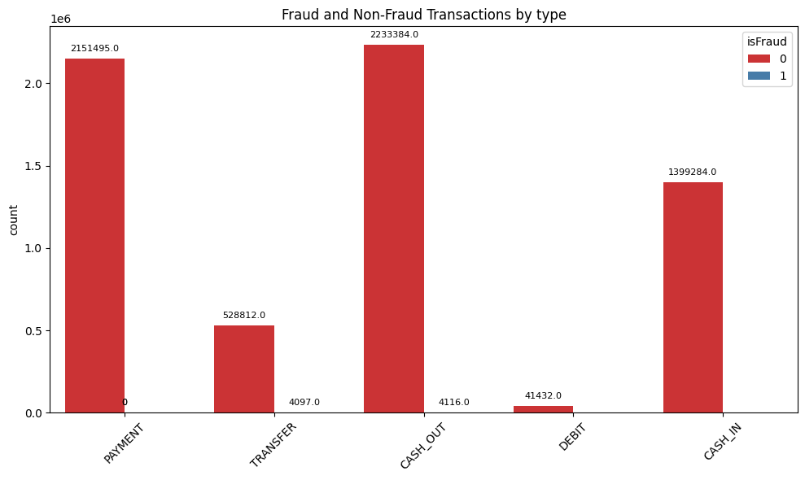
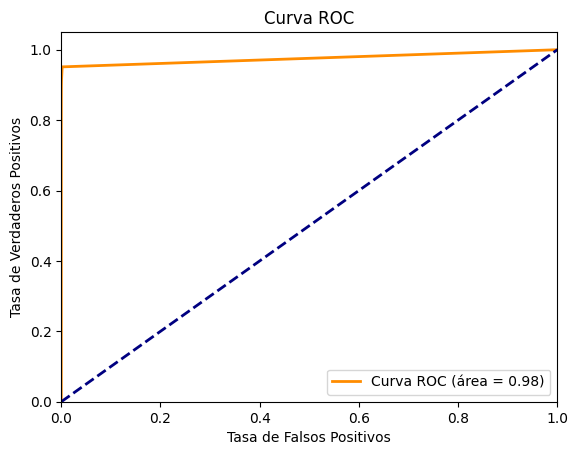
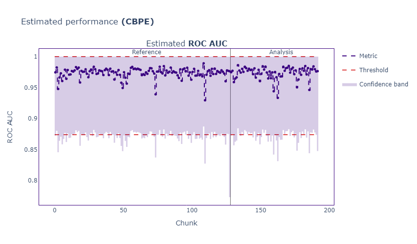

# Online Payment Fraud Detection
En este proyecto, se analizará la base de datos **Online Payment Fraud Detection** de Kaggle. A lo largo del proyecto, abarcaremos todo el proceso de un estudio típico de análisis de datos, desde la carga de los datos, el análisis exploratorio de datos, el preprocesado de datos y la preparación de estos para crear un algoritmo de aprendizaje automático. También realizaremos el ajuste de hiperparámetros y entrenaremos el modelo. Por último, se mostrará una forma de monitorizar el modelo mediante la libreria NannyML.

Sin embargo, lo más importante de este trabajo es mostrar una forma de automatizar el proceso a través de funciones, de modo que se puedan recibir datasets similares y ejecutar todos los pasos de forma automática.

### Parte 1: Carga de datos y EDA

En el análisis exploratorio de datos se realiza una captura de información fundamental de la estructura de los datos, tipos de variables, estadísticas principales y valores ausentes.

Se crean varias funciones donde a partir de una variable objetivo definida (la variable binaria fraude o no fraude) se sacan varias visualizaciones como histogramas, boxplots o barras de distribución por la variable objetivo.

**PRIMERO**: Carga de datos y definir la variable objetivo, los datos se extraen de este [fichero de Kaggle](https://www.kaggle.com/datasets/jainilcoder/online-payment-fraud-detection).

**SEGUNDO**: Realización de un EDA, se automatizan los procesos mediante funciones, a los cuales les pasamos los datos y la función objetivo para extraer la distribución de las variables y las relaciones entre variables.

### Parte 2: Data Cleaning y Feature engineering

En el segundo paso, simplemente eliminamos los datos duplicamos e imputamos los datos faltantes mediante la media para las variables númericas y con la moda para las variables categóricas.

En Feature engineering para este caso en concreto, creamos una nueva columna a partir de las columnas nameOrig y nameDest para saber la dirección de las transacciones.

### Parte 4: Modeling

En la fase de modelado vamos a crear un modelo de ML, en este caso, un Random Forest.

- Valores de entrada: Los datos después de las fases de limpieza e ingeniería de características
- Valores de salida: El modelo final entrenado, junto con un conjunto de test para después los resultados.

Nos centramos nuevamente en la automatización y encapsulado del modelo, para ello con un pipeline encerramos el procesamiento necesario de las variables, el ajuste de hiperparametros y el entrenamiento del modelo, designando las métricas de evaluación, en nuestro caso, "auc_roc".

Por último, se crea una función para realizar predicciones y evaluar el modelo.

### Parte 5: Monitoring

Por último, vamos a ver una forma de monitorear el modelo mediante la librería Nannyml, esta librería ofrece herramientas para monitorear el rendimiento del modelo, detectar cambios en los datos o en las distribuciones del modelo, es decir, detecta problemas de Data Drift y permite tomar medidas correctivas cuando se detectan desviaciones.

